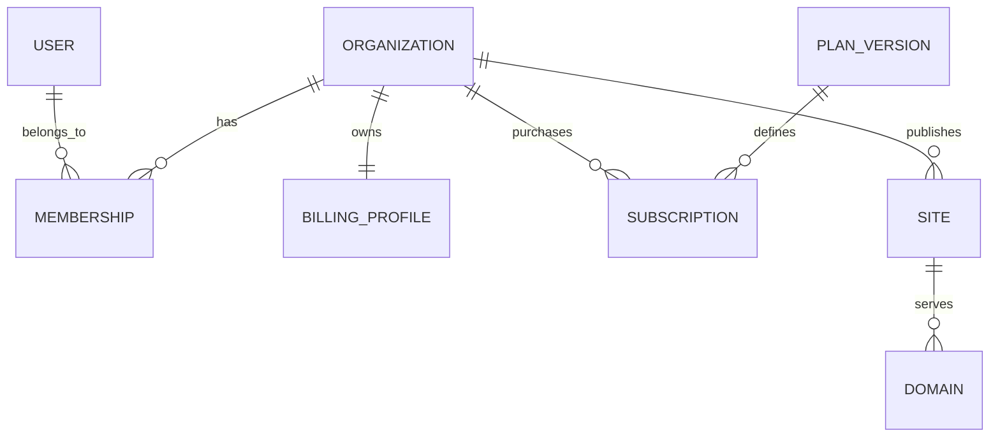

# SaaS Core - model danych i uprawnienia

## 1. Zasady modelowania

- `User` reprezentuje człowieka.
- `Organization` reprezentuje konto klienta, gabinet, firmę lub workspace prywatny.
- `Membership` łączy użytkownika z organizacją i rolą.
- `Customer` reprezentuje pacjenta lub klienta końcowego organizacji.
- `Subscription` i limity należą do organizacji.
- Dane tenantowe posiadają `organization_id` lub jednoznaczne powiązanie z organizacją.
- Dane branżowe rozszerzają modele Core przez osobne tabele.
- Nie używamy jednego dużego pola JSON jako substytutu modelu domenowego.

## 2. Model relacji podstawowych



## 3. Identity

### User

Minimalne pola:

- `id`;
- `email`;
- `email_verified_at`;
- `password_hash` lub powiązanie z providerem tożsamości;
- `preferred_locale`;
- `timezone`;
- `is_active`;
- `last_login_at`;
- `created_at`;
- `updated_at`.

Dalsze encje:

- `UserSession`;
- `EmailVerification`;
- `PasswordReset`;
- `MfaMethod`;
- `RecoveryCode`;
- `LoginAttempt`.

## 4. Organizacje

### Organization

- `id`;
- `name`;
- `slug`;
- `workspace_kind`: personal/business;
- `status`: onboarding/active/suspended/archived;
- `default_locale`;
- `timezone`;
- `currency`;
- `created_at`;
- `updated_at`.

### Membership

- `organization_id`;
- `user_id`;
- `role_id`;
- `status`;
- `joined_at`;
- `invited_by`.

Unikalność: jedna aktywna relacja użytkownika z organizacją.

### BillingProfile

- rodzaj klienta: osoba/firma;
- nazwa prawna;
- NIP/VAT ID;
- adres;
- kraj;
- e-mail rozliczeniowy;
- identyfikator klienta Stripe;
- dane wymagane przez wybranego dostawcę faktur.

## 5. Role i permissions

Domyślne role:

| Rola | Przeznaczenie |
| --- | --- |
| Owner | własność organizacji, płatności, usunięcie organizacji |
| Admin | pełne zarządzanie bez przeniesienia własności |
| Manager | operacje biznesowe i zespół w ograniczonym zakresie |
| Staff | codzienna obsługa przydzielonych obszarów |
| Viewer | odczyt wybranych danych |

Permission powinien być kluczem, np.:

```text
organization.members.manage
site.content.edit
site.publish
domain.manage
organization.billing.manage
booking.appointment.manage
medical.doctor.manage
```

Każda operacja jest sprawdzana po stronie API. Ukrycie przycisku w frontendzie nie jest zabezpieczeniem.

## 6. Plany i entitlementy

### Plan

Logiczna nazwa oferty, np. Basic, Pro, Business.

### PlanVersion

Niemutowalna wersja parametrów planu. Istniejące subskrypcje mogą pozostać na starszej wersji.

### Feature

Klucz funkcji, np.:

```text
sites.enabled
custom_domain.enabled
booking.enabled
ai_assistant.enabled
```

### QuotaDefinition

Klucz limitu, np.:

```text
sites.max
team_members.max
storage.bytes
email.monthly
ai.tokens.monthly
```

### EntitlementGrant

Źródła przyznania:

- plan;
- trial;
- administracyjne nadpisanie;
- promocja;
- partnerstwo;
- zakup dodatku.

### UsageCounter

- organizacja;
- klucz limitu;
- okres rozliczeniowy;
- zużycie;
- czas ostatniej aktualizacji.

Reguła: stan Stripe nie jest sprawdzany przy każdym żądaniu. Webhook aktualizuje lokalny stan, a autoryzacja używa lokalnego, audytowalnego snapshotu.

## 7. Stan subskrypcji

Wewnętrzne stany dostępu:

```text
trialing
active
grace_period
read_only
suspended
canceled
```

Mapowanie ze Stripe jest częścią modułu Billing. Nie usuwamy danych natychmiast po nieudanej płatności. Najpierw organizacja przechodzi przez okres karencji i tryb tylko do odczytu zgodnie z polityką produktu.

## 8. Sites, domeny i treści

Podstawowe encje:

- `Site`;
- `Domain`;
- `Page`;
- `PageVersion`;
- `PageBlock`;
- `ContentEntry`;
- `ContentTranslation`;
- `Navigation`;
- `Theme`;
- `DesignTokenSet`;
- `MediaAsset`;
- `Publication`.

Treści tłumaczone są w osobnych rekordach, nie w kolumnach per język.

### Domain

- `site_id`;
- `hostname`;
- `kind`: platform_subdomain/custom;
- `verification_token`;
- `verification_status`;
- `tls_status`;
- `is_canonical`;
- `verified_at`;
- `last_checked_at`.

## 9. Customer a User

Pacjent lub klient salonu nie jest automatycznie użytkownikiem SaaS-a.

```text
User
  osoba zarządzająca organizacją

Customer
  klient końcowy konkretnej organizacji

CustomerPortalIdentity
  opcjonalne przyszłe konto klienta końcowego
```

Pozwala to uruchomić rezerwację bez wymagania rejestracji pacjenta oraz bez mieszania personelu z klientami końcowymi.

## 10. Model Booking

Encje wspólne:

- `Location`;
- `StaffMember`;
- `Service`;
- `Resource`;
- `AvailabilityRule`;
- `TimeOff`;
- `Appointment`;
- `AppointmentStatusHistory`;
- `Customer`;
- `Reminder`;
- `PaymentReservation`.

Rozszerzenia:

```text
StaffMember
  -> MedicalDoctorProfile
  -> BeautyProfessionalProfile

Appointment
  -> MedicalAppointmentDetails
  -> BeautyAppointmentDetails
```

## 11. Multi-tenancy

Wewnątrz jednego deploymentu:

- wspólna baza i schemat;
- `organization_id` na danych tenantowych;
- automatyczny tenant scope w warstwie danych;
- testy wykrywające dostęp między tenantami;
- zakaz przyjmowania `organization_id` bez weryfikacji membership;
- opcjonalne PostgreSQL Row Level Security jako druga warstwa dla danych wrażliwych.

Oddzielne verticale korzystają z oddzielnych deploymentów i baz.

## 12. Dane wspólne w większości tabel

W zależności od encji:

- `id` jako UUID;
- `organization_id`;
- `created_at`;
- `updated_at`;
- `created_by`;
- `updated_by`;
- `archived_at`;
- `deleted_at`;
- `version` do optimistic locking;
- `metadata` tylko dla danych pomocniczych, nie głównej logiki.

## 13. Pytania do kolejnego etapu

- [x] UUID v4 czy UUID v7 — UUIDv7, ADR-022;
- [x] dokładny mechanizm tenant context w Django — ADR-022 i kontrakt tenancy;
- [x] zakres PostgreSQL RLS od pierwszej wersji — ADR-022;
- [x] session cookies czy osobny token access/refresh — sesja Django, ADR-023;
- [ ] okres karencji po płatności;
- [ ] polityka retencji po anulowaniu;
- [ ] możliwość wielu aktywnych subskrypcji/add-onów;
- [ ] model wersjonowania tłumaczeń;
- [ ] model kalendarzy i blokad transakcyjnych.
