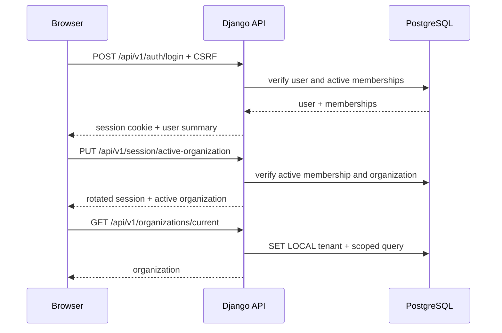

# Uwierzytelnianie i tenant context

## 1. Topologia

Panel i API przeglądarkowe są same-origin:

```text
browser -> https://app.medplano.pl
                       |
                       +-- /api/v1/* -> Caddy -> Django
                       |
                       +-- pozostałe  -> Caddy -> Next.js

integracje -> https://api.medplano.pl -> Django (osobny auth, bez cookie panelu)
```

Dzięki temu podstawowy panel nie wymaga CORS. Publiczne API integracyjne będzie
miało osobny mechanizm tokenów i nie rozszerzy zakresu cookie sesyjnego.

## 2. Sesja i cookies

- sesje Django używają backendu `cached_db`;
- cookie sesji: host-only, `HttpOnly`, `Secure`, `SameSite=Lax`;
- cookie CSRF: host-only, `Secure`, czytelne dla klienta i przesyłane nagłówkiem
  `X-CSRFToken` przy żądaniach modyfikujących;
- nie ustawiamy `Domain=.medplano.pl`;
- identyfikator sesji, CSRF ani token nie trafia do `localStorage`;
- logowanie i zmiana hasła rotują identyfikator sesji;
- produkcyjne proxy przekazuje poprawny host i protokół, a Django ufa wyłącznie
  skonfigurowanemu proxy.

## 3. Logowanie i wybór organizacji



Jeżeli użytkownik ma jedno aktywne membership, backend wybiera je podczas
logowania. Przy wielu organizacjach wymagany jest jawny wybór. Aktywna
organizacja jest zapisana po stronie serwera w sesji, a wartość wysłana przez
klienta jest tylko żądaniem zmiany, nigdy źródłem zaufania.

## 4. Scenariusze negatywne

- brak lub błędny CSRF przy mutacji: `403` z Problem Details;
- nieaktywne konto: sesja nie jest tworzona;
- membership odebrany podczas sesji: kolejne żądanie zwraca `403`, usuwa aktywną
  organizację z sesji i wymaga ponownego wyboru;
- zawieszona organizacja: odczyty niezbędne do obsługi konta mogą być dozwolone,
  operacje domenowe są blokowane kodem `organization_suspended`;
- organizacja spoza membership: odpowiedź `404`, aby nie ujawniać istnienia;
- brak tenant context dla repozytorium tenantowego: kontrolowany błąd serwera i
  alert; zapytanie nie jest wykonywane;
- worker z nieaktywną organizacją lub membership: zadanie kończy się bez mutacji,
  z audytowalnym statusem;
- próba użycia cookie panelu na `api.medplano.pl`: cookie nie jest wysyłane z
  powodu host-only scope.

Każdy przypadek jest testem integracyjnym, a dostęp cross-tenant dodatkowo testem
bezpośrednim na PostgreSQL.
