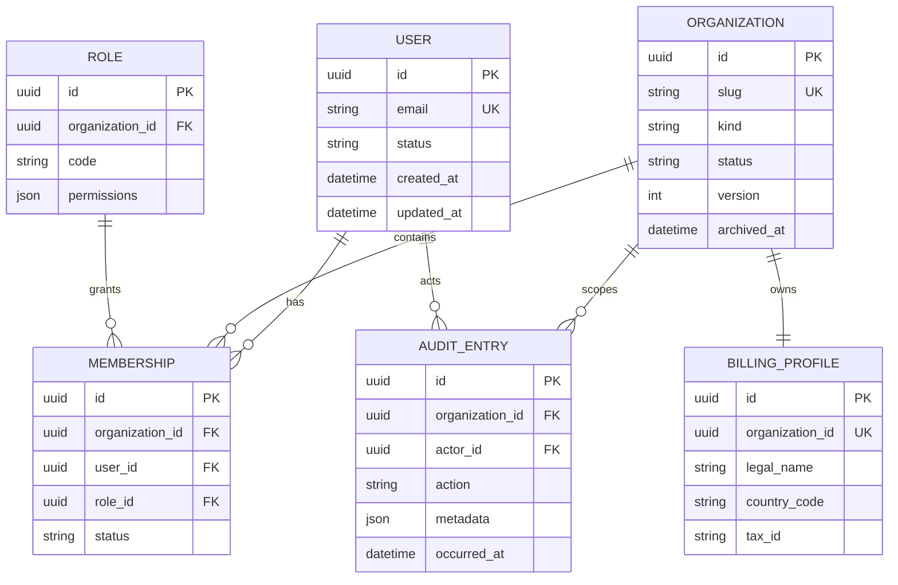

# Model bazowy i tenancy

## 1. Model startowy



Wszystkie identyfikatory są UUIDv7 generowanymi w aplikacji. Daty przechowujemy
w UTC. `User.email` jest normalizowany i unikalny bez uwzględniania wielkości
liter. Customowy model `User` powstaje w migracji `0001` i nie jest później
zamieniany.

## 2. Ograniczenia

- `Membership`: unikalne `(organization_id, user_id)` dla rekordów aktywnych;
- `Role`: unikalne `(organization_id, code)`; role systemowe mogą mieć
  `organization_id = NULL` i unikalny globalny `code`;
- `BillingProfile`: dokładnie jeden rekord na organizację;
- każdy indeks encji tenantowej zaczyna się od `organization_id`, jeżeli jest to
  zgodne z zapytaniem;
- `Organization` ma optimistic lock przez rosnące `version`;
- `Organization` jest archiwizowana, nie usuwana fizycznie;
- membership jest odwoływany statusem i `revoked_at`; historia pozostaje;
- wpisy audytu oraz zdarzenia outbox są append-only.

Soft delete nie jest domyślną cechą wszystkich modeli. Używamy go tylko tam,
gdzie istnieje wymaganie odzyskania lub retencji; zwykłe tabele słownikowe
korzystają z jawnego statusu lub fizycznego usunięcia chronionego relacjami.

## 3. Ustanowienie tenant context

```text
request -> session user -> active_organization_id
        -> active Membership + Organization status
        -> TenantContext(ContextVar)
        -> transaction + SET LOCAL app.organization_id
        -> service/use case -> tenant-scoped repository
```

Middleware jedynie uwierzytelnia i ustanawia kontekst. Reguły biznesowe są w
use case'ach. Manager encji tenantowej bez `TenantContext` zgłasza wyjątek;
nie przechodzi automatycznie do zapytania globalnego. Zadanie Celery otrzymuje
`organization_id` jawnie i odtwarza kontekst po ponownej weryfikacji organizacji.

Operacje operatora cross-tenant używają osobnego, audytowanego interfejsu i roli
bazodanowej. Nie wolno realizować ich przez wyłączenie filtra w zwykłym managerze.

## 4. Początkowy zakres RLS

RLS od pierwszej migracji obejmuje `Customer`, `Appointment` oraz prywatne
`MediaAsset`. Polityka porównuje `organization_id` z ustawieniem transakcji
`app.organization_id`. Rola aplikacyjna nie ma `BYPASSRLS`; migracje wykonuje
osobna rola. Test musi dowieść, że brak `SET LOCAL`, błędny tenant oraz próba
bezpośredniego odczytu zwracają zero rekordów albo błąd, nigdy cudze dane.

Zakres jest rozszerzany na encje medyczne przed ich wdrożeniem. RLS jest drugą
warstwą ochrony i nie zastępuje kontroli permissionów ani filtrów aplikacyjnych.
